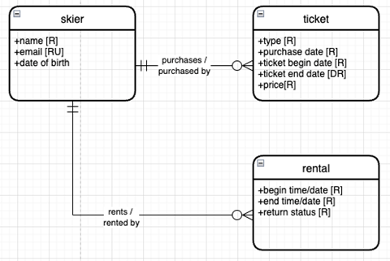
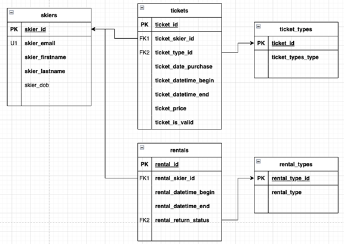
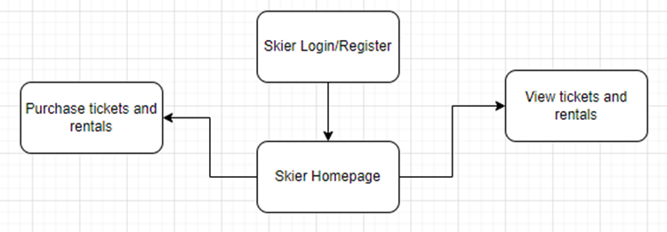
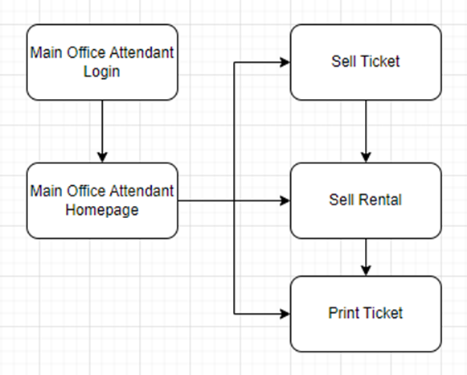
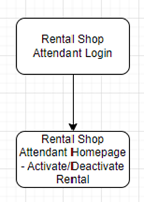

# Ski Resort Management System

## Table of Contents
- [Project Overview](#project-overview)
- [Team Members](#team-members)
- [Features](#features)
- [Database Design](#database-design)
- [Installation](#installation)
- [Usage](#usage)
- [Project Structure](#project-structure)
- [Contributing](#contributing)
- [License](#license)
- [Acknowledgements](#acknowledgements)

## Introduction

Efficient data management is crucial for the ski industry, characterized by seasonal peaks, a diverse customer base, and extensive equipment inventory. This project focuses on creating a comprehensive database system to track skiers, their ticket purchases, and rental equipment, streamlining operations, enhancing customer experience, and optimizing resource management for ski resorts.

## Project Overview

This project aims to design, implement, and evaluate a database system for a ski resort. The database tracks skier activities, ticket sales, and rental equipment, providing real-time data access, smooth transactions, and efficient equipment management. The database also offers insights into customer preferences, helping ski resorts tailor their services.

## Team Members
- **Blake Tindol**
- **Sean Deery**
- **Christian Dobish**
- **Leonard Lasek**

## Features
- **Skier Management**: Manage skier information and track their activities.
- **Ticket Sales**: Purchase and validate lift tickets.
- **Equipment Rentals**: Rent and manage ski equipment.
- **Staff Operations**: Support operations for office attendants and rental shop staff.
- **Real-Time Data Views**: Various views for monitoring resort activities and ticket validation at lift gates.

## Tools
- Draw.io
- Azure Data Studio
- Microsoft SQL Server (MSSQL)

## Database Design
The project involves multiple stages of database design:
1. **Data Analysis**: Identified entities, attributes, and relationships.
2. **Conceptual Data Model**: High-level diagram representing the data model.
3. **Logical Data Model**: Detailed schema including tables and relationships.
4. **External Data Model**: Views and stored procedures for operations.

### Conceptual Model


### Logical Model


### External Data Model and Data Logic
- **Views**: For resort management, main office, and lift gate validation.
- **Stored Procedures**: For creating accounts, selling tickets and rentals, and managing rental operations.

## User Flow Diagrams

Developed User Flow Diagrams for different stakeholders:

- **Skier Application**: Sign in/Register, view tickets and rentals, purchase tickets, add rentals.

- **Main Office Attendant Application**: Attendant sign in, print tickets, sell tickets, sell rentals.

- **Rental Shop Attendant Application**: Attendant sign in, view returns dashboard, distribute/collect rentals.


## Installation
To set up the project locally using an MSSQL database and Azure Data Studio, follow these steps:

1. **Clone the repository**:
   ```bash
   git clone https://github.com/sdeery14/ski-resort-database.git
   ```

2. **Navigate to the project directory**:
   ```bash
   cd ski-resort-management
   ```

3. **Set up the database**:
   - Open Azure Data Studio and connect to your MSSQL server.
   
4. **Run the SQL scripts to set up the database schema and load initial data**:
   - Open the `ski-resort-internal-updown.sql` script in Azure Data Studio and execute it to set up the internal database schema and load the data.
   - Execute the `ski-resort-external-updown.sql` script to set up views and stored procedures:

## Usage
Once the database is set up, you can perform various operations. See the `ski-resort-test-griffins.sql` script to see examples:
1. **Selling Tickets and Rentals**:
   - Use the stored procedures `p_sell_ticket` and `p_sell_rental` to manage ticket and rental sales.
2. **Managing Rentals**:
   - Activate and deactivate rentals using `p_activate_rental` and `p_deactivate_rental`.
3. **Data Views**:
   - Access different views like `v_manager`, `v_attendant`, and `v_lift` for operational insights.

## Project Structure
- `ski-resort-external-updown.sql`: Contains SQL scripts for setting up the external side of the database database.
- `ski-resort-internal-updown.sql`: Contains SQL scripts for setting up the internal side of the database.
- `ski-resort-test-griffins.sql`: Contains SQL scripts to simulate a family visit.
- `ski-resort-database-report.docx`: Documentation including data models and project report.

## License
This project is licensed under the MIT License - see the [LICENSE](LICENSE) file for details.
